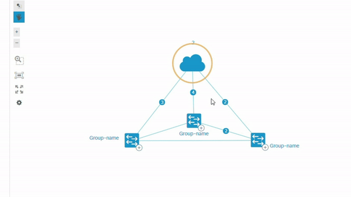

# Consulta CECOM

Sistema desarrollado para el Centro de Comunicaciones SDN, con el objetivo de ayudar al personal que da soporte técnico, a través de una plataforma amigable que permite consultar IPs y Vlans, obteniendo información y gráficas de interés.

## Librerias:
- Flask
- NextUI:
    - https://github.com/NeXt-UI/next-tutorials
    - https://github.com/NeXt-UI/next-site/tree/master/example-page-generator (descargar y abrir codigos)
    - https://developer.cisco.com/site/neXt/learn/

 </img>
 </img>
